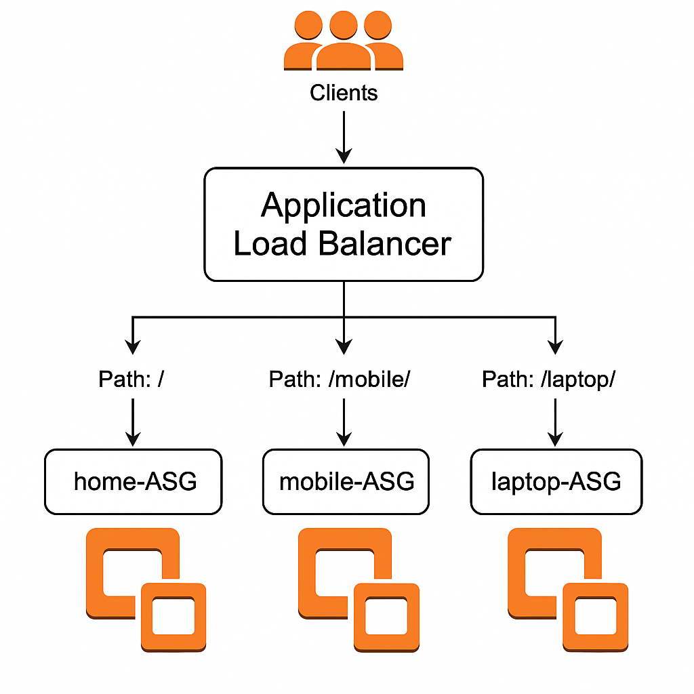

##  Deployed Extended Application Using Application Load Balancer With Auto Scaling 

#### This Project guides you how to deploy a **Three-Part Web Application** on aws using :

- Amazon EC2

- Application Load Balancer 

- Auto Scaling Group 

This Application serves distinct content on the **Home** , **Mobile** and **Laptop** paths , each powered by its own EC2 group managed by Auto Scaling .

## Objective :

- Deploy a scalable and highly available application .

- Automatically manage instance scaling using **Auto Scaling Groups**  **.**

- Distribute incoming traffic effectively with an **Application Load Balancer** **.**

## Deployment Steps : 

### Step 1 : Create 3 Launch Templates And User Data Scripts 

1. **Home-LT** 

* User Data Scripts 

#### bash 
      
    #!/bin/bash
    yum update -y 
    yum install -y httpd 
    sudo systemctl start httpd
    sudo systemctl enable httpd
    echo "<h1>This is Home page $(hostname -f)</h1>" > /var/www/html/index.html 

2. **Mobile-LT** 

* User Data Scripts 

#### bash 

     #!/bin/bash
     yum update -y 
     yum install -y httpd 
     sudo systemctl start httpd
     sudo systemctl enable httpd
     mkdir -p /var/www/html/mobile 
     echo "<h1>This is mobile page $(hostname -f)</h1>" > /var/www/html/mobile/index.html

3. **Laptop-LT** 

* user Data Scripts 

#### bash 

    #!/bin/bash
    yum update -y 
    yum install -y httpd 
    sudo systemctl start httpd
    sudo systemctl enable httpd
    mkdir -p /var/www/html/laptop 
    echo "<h1>This is laptop page $(hostname -f)</h1>" > /var/www/html/laptop/index.html

---
### Step 2 : Create Three Auto Scaling Groups 

- #### Each ASG is configured with a unique scaling policy :

1. **Home-ASG** : Dynamic Scaling Policy 

2. **Mobile-ASG** : Static Scaling Policy 

3. **Laptop-ASG** :  Initially used dynamic scaling but later switched to a scheduled scaling policy using cron syntax.

---
### Step 3 : Assign Scheduled Policy 
-  Auto-Scaling-group --> Laptop-ASG --> Automatic Scaling --> Scheduled Actions --> Create Shcheduled Actions 

---

### Step 4 : Create Target Groups :

- Three Target Groups were created and linked to their respective ASGs : 

- To link tagret Groups with their respective ASG :

Auto-Scaling-Groups --> Select ASG --> Actions --> Edit --> Load Balancing --> Select TG --> Update 

1. **Home-TG**

2. **Mobile-TG**

3. **Laptop-TG**

---

### Step 5 : Create Load balancer :

- Create an **Application load Balancer (ALB)** .

---
### Step 6 : Add listener Rules : 

- #### DeFault Target group - Home-Tg
Listener Rules : 

/Mobile/* - Mobile-tg

/laptop/* - Laptop-tg

---

### OUTPUT : 

**Home-page**

**Mobile-page** 

**Laptop-page**

---
> #### With this setup , the extended application is deployed using **Application Load Balancer With Auto Scaling** , ensuring high availability , scalability , and efficient traffic distribution .
 